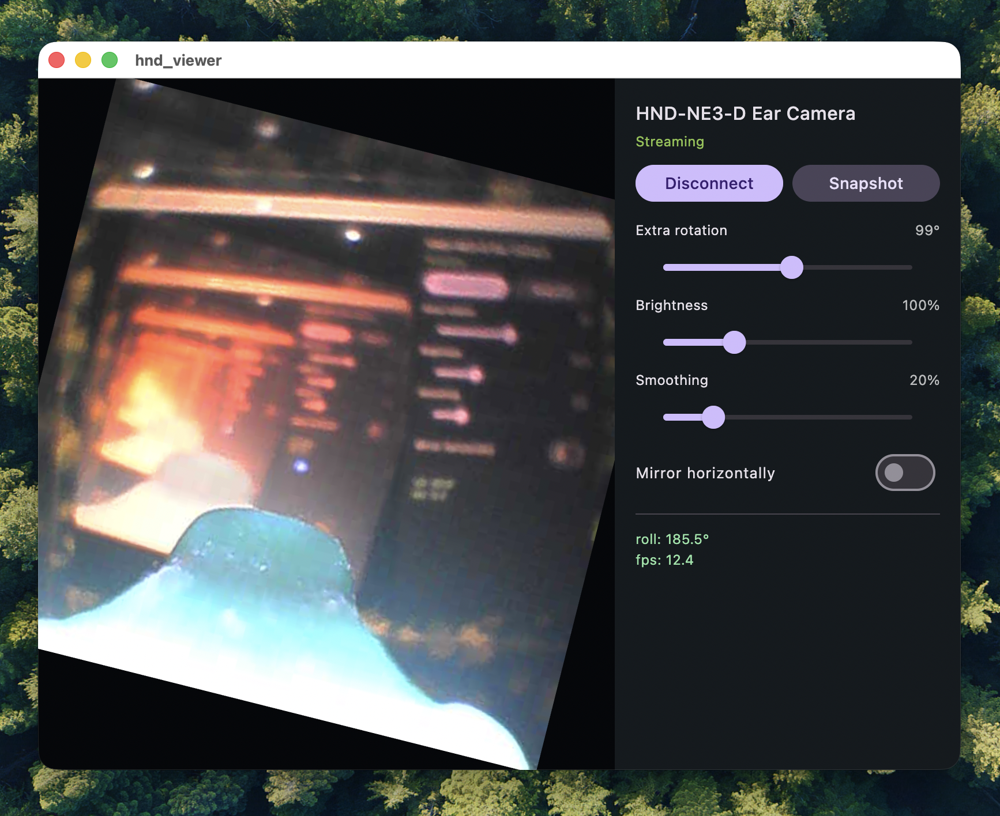
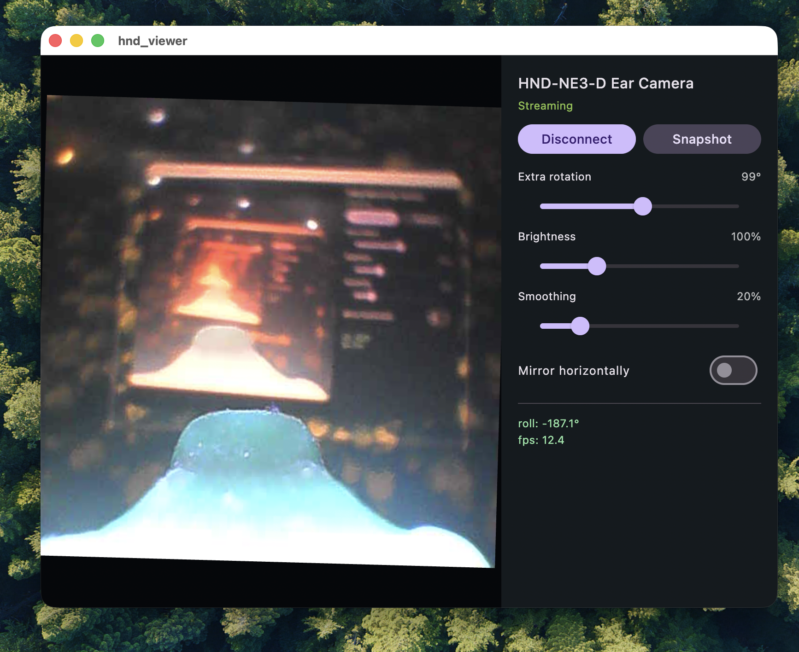

# hnd-viewer

Cross-platform viewer for the **HND-NE3-D ear camera** (Beken BK7231).
It connects to a factory-sealed unit's Wi-Fi AP and shows the live video
stream plus gyro orientation — no vendor (Chinese, Android-only) companion
app required.

One Flutter codebase targeting **Android, iOS, macOS, Windows, and Linux**.

**Website:** <https://txt.fuho.org/hnd-viewer/> · **Source & releases:**
<https://github.com/fuho/hnd-viewer>

## Why

The factory unit boots its own Wi-Fi AP (`HNDEC_55-xxxxxx`) and streams a
480×480 JPEG video (~12 fps) plus 3-axis accelerometer data over raw UDP
sockets. The vendor app is Android-only and Chinese-language. This project
is a free, open, fully offline-capable replacement viewer.

## What it does

- Discover / connect to the camera AP (gateway `192.168.1.1`)
- Live 480×480 video with rotation, mirror, and brightness
- Gyro roll overlay (the ear camera's orientation)
- Snapshot to gallery
- MP4 recording (FFmpeg writer done; UI wiring pending)

## Screenshots / demo

Live camera view with the gyro roll overlay:



The viewer window and controls:



Screen recording of hnd-viewer streaming from the camera:

<video src="media/screenshots/hnd-viewer-demo.mp4" controls width="640"></video>

## The protocol

The camera runs **no HTTP server** — everything is raw UDP on fixed ports.
Browsers cannot open UDP sockets, which is why this is a native app, not a
web page. Full wire spec: [`docs/PROTOCOL.md`](docs/PROTOCOL.md). The
protocol was reverse-engineered and re-implemented from scratch for this
project; it carries no vendor code.

## Status

In progress.

- [x] Standalone repo + 5-platform scaffold (Android/iOS/macOS/Windows/Linux)
- [x] Pure-Dart protocol core (discovery + video reassembly + gyro/roll),
      unit-tested — 27 tests, including a loopback UDP integration test
- [x] Live-view UI (video + gyro roll + rotation/mirror/brightness/smoothing)
- [x] Snapshot to gallery
- [ ] MP4 recording (FFmpeg writer done; UI Record button pending)
- [ ] Packaging / installers for all five targets

## Running the macOS build

The macOS build is **unsigned and not notarized**, so Gatekeeper blocks it on
first launch. To run it:

1. Download and unzip `hnd-viewer-v0.1.0-macos.app.zip`.
2. **Right-click** `hnd_viewer.app` → **Open** → **Open** (once).

Or via Terminal:

```sh
xattr -cr /path/to/hnd_viewer.app
open /path/to/hnd_viewer.app
```

On first run macOS may also ask to allow **local network** access (to reach the
camera) and **Downloads** (to save snapshots) — accept both.

## Development

Requires the Flutter SDK (stable channel).

```sh
flutter pub get
flutter test              # protocol unit tests (no device needed)
flutter run               # live view on a connected device
flutter build apk --debug # Android debug APK
```

Android builds need a JDK 17 and an Android SDK containing the `android-36`
platform, an NDK, and build-tools. `android/debug.keystore` is committed (the
standard public `androiddebugkey` credential, not a secret) so debug signing
is hermetic. macOS/iOS builds require a full Xcode install.

## License

To be chosen.
